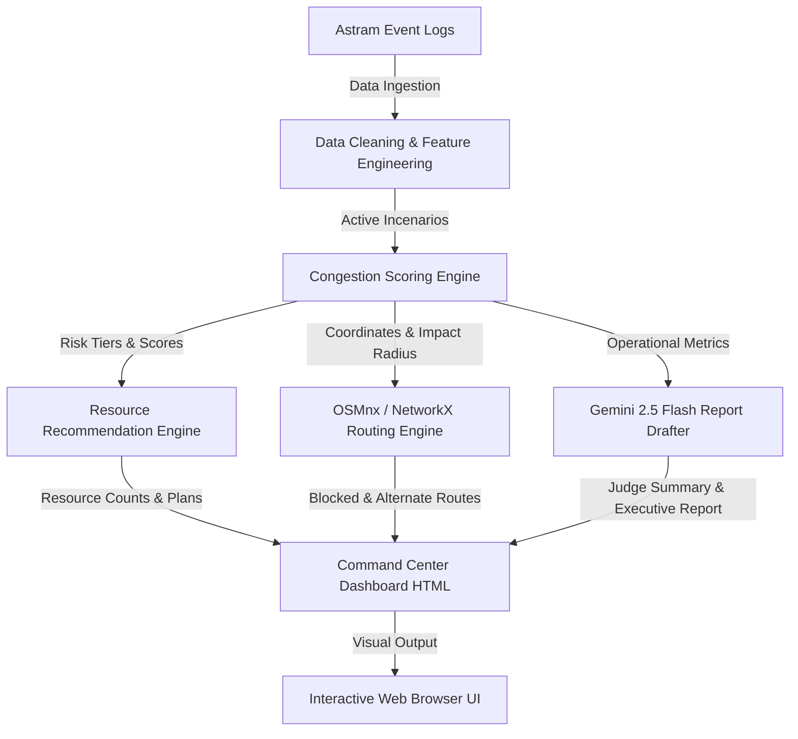
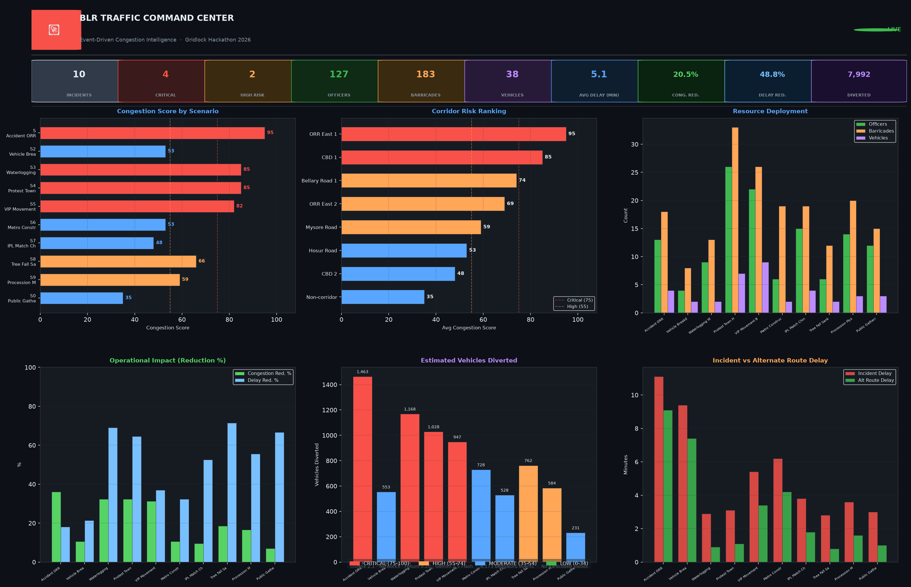
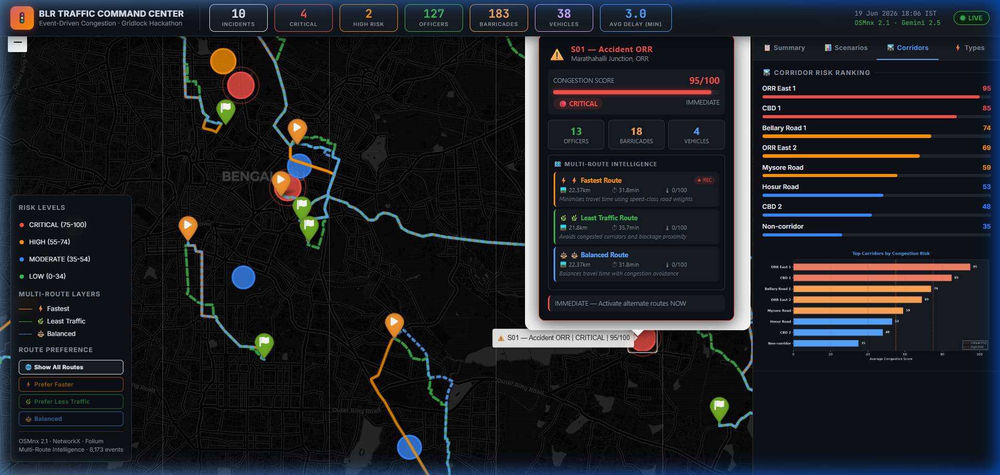
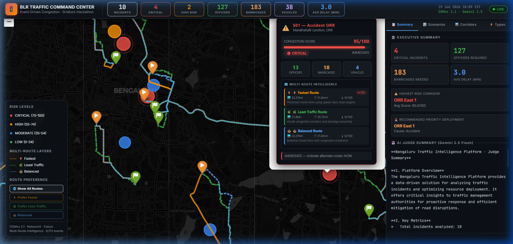

# 🚦 Bengaluru Traffic Intelligence Platform
### *Event-Driven Congestion Intelligence & Resource Optimization*

---

[](https://github.com/NITESH100LANKI/blr-traffic-intelligence)
[](https://www.python.org/)
[](https://osmnx.readthedocs.io/)
[](https://python-visualization.github.io/folium/)
[](https://deepmind.google/technologies/gemini/)

The **Bengaluru Traffic Intelligence Platform** is a data-driven solution designed for traffic management authorities. It ingest event logs, scores congestion severity, computes alternate routes to bypass blockages, recommends precise field resources (officers, barricades, patrol vehicles), and leverages Generative AI (Gemini 2.5 Flash) to draft executive incident summaries.

---

## 📖 Table of Contents
1. [Problem Statement](#-problem-statement)
2. [Solution Overview](#-solution-overview)
3. [System Architecture](#-system-architecture)
4. [Key Features](#-key-features)
5. [Technology Stack](#-technology-stack)
6. [Multi-Route Routing Logic](#%EF%B8%8F-multi-route-routing-logic)
7. [AI Incident Reporting](#-ai-incident-reporting)
8. [Dashboard & Screenshots](#-dashboard--screenshots)
9. [Installation & Setup](#-installation--setup)
10. [Usage Instructions](#-usage-instructions)
11. [Results & Operational Metrics](#-results--operational-metrics)
12. [Future Improvements](#-future-improvements)

---

## 🚨 Problem Statement
Bengaluru's road network experiences severe gridlocks due to unplanned incidents like accidents, vehicle breakdowns, protests, and waterlogging. These events lead to:
* **Compounded Delays**: Extended commuter travel times and high economic losses.
* **Sub-Optimal Resource Allocation**: Inefficient manual deployment of traffic police and barricades.
* **Delayed Emergency Response**: Difficulty in routing emergency vehicles and coordinating municipal agencies.

Proactive, data-driven traffic command systems are critical to analyzing live incidents, predicting risk, diverting vehicles, and optimizing field resource deployment.

---

## 💡 Solution Overview
This platform coordinates multiple modules to ingest, evaluate, and mitigate traffic bottlenecks:
1. **Data Pipeline**: Cleans and filters event data (from 8,173 raw events) down to active scenarios.
2. **Congestion Engine**: A multi-factor scoring engine (0-100 scale) that assigns risk tiers (CRITICAL, HIGH, MODERATE, LOW) using incident cause, priority, rush hour status, and corridor severity weights.
3. **Resource Recommender**: Computes recommended traffic officers, barricades, and patrol vehicles using cause-specific rules adjusted by rush hour, road closure, and corridor factors.
4. **Alternate Route Engine**: Interacts with the Bengaluru road network using **OSMnx 2.1** and **NetworkX**. It calculates shortest paths and alternate bypass routes around the incident's impact radius.
5. **AI Report Drafter**: Calls **Gemini 2.5 Flash** to draft executive briefings, highlighting key metrics, top-risk corridors, and critical scenarios.
6. **Command Center Dashboard**: Outputs an interactive, dark-themed HTML/JS page rendering GIS map routes, popup metrics, KPI cards, and risk charts.

---

## 🏗️ System Architecture



---

## ✨ Key Features
* **Interactive GIS Map**: Rendered via Leaflet & Folium, displaying markers, impact zones, blocked routes (Red), and alternate routes (Green).
* **Dynamic Popup Intel**: Clicking any incident displays an "Operational Intelligence" panel with impact radius, clearance times, and specific diversion percentages.
* **Automated Key Performance Indicators**: Live dashboard cards showing Total Incidents, Critical Counts, total Officers/Barricades required, Avg Delay, Congestion/Delay Reduction, and Vehicles Diverted.
* **AI-Generated Summary Briefs**: Real-time markdown and plain text briefings detailing city-wide status.
* **Professional Executive Reports**: Generates formal PDFs with structured tables, corridor risk rankings, and system architecture.

---

## 🛠️ Technology Stack
* **Routing & Spatial Analytics**: OSMnx 2.1.0, NetworkX, SciPy
* **Interactive Mapping**: Folium 0.20.0, Leaflet.js
* **Generative AI**: Google Gemini 2.5 Flash SDK (`google-generativeai`)
* **Data Processing**: Pandas, NumPy
* **Visualization & Reporting**: Matplotlib, Seaborn, ReportLab (PDF)
* **Frontend**: Vanilla HTML5, CSS3, JavaScript (ES6)

---

## 🛣️ Multi-Route Routing Logic
The Routing Engine models the road network of Bengaluru as a directed multigraph $G = (V, E)$ using OSMnx:
1. **Source & Destination Mapping**: Geocodes the start and end coordinates of the diversion zone to the nearest network nodes:
   $$v_{src} = \text{nearest\_nodes}(G, \text{source\_coords})$$
   $$v_{dst} = \text{nearest\_nodes}(G, \text{destination\_coords})$$
2. **Baseline Route Calculation**: Computes the shortest path using Dijkstra's algorithm weighted by edge length (meters):
   $$P_{orig} = \text{shortest\_path}(G, v_{src}, v_{dst}, \text{weight='length'})$$
3. **Dynamic Blockage & Sub-Graph Generation**: When an incident occurs at $(lat_{inc}, lon_{inc})$ with impact radius $r_{impact}$, nodes within the radius are identified:
   $$V_{blocked} = \{ v \in V \mid \text{Haversine}(v, \text{incident\_coords}) \le r_{impact} \}$$
   A blocked sub-graph is constructed by removing these nodes:
   $$G_{blocked} = G \setminus V_{blocked}$$
4. **Alternate Route Calculation**: Calculates the bypass route on the modified network:
   $$P_{alt} = \text{shortest\_path}(G_{blocked}, v_{src}, v_{dst}, \text{weight='length'})$$
5. **Operational Analytics**: Computes extra distance and estimated travel delays:
   $$\Delta \text{Distance} = \text{Length}(P_{alt}) - \text{Length}(P_{orig})$$
   $$\text{Delay}_{\text{alt}} = \frac{\Delta \text{Distance}}{30 \text{ km/h}} \times 60 \text{ minutes}$$

---

## 🤖 AI Incident Reporting
The platform integrates **Gemini 2.5 Flash** to analyze live data from `demo_results.csv` and draft summaries:
* **Contextual Analysis**: Passes the active scenario list, severity categories, resource counts, and calculated route delays to the model.
* **Strict Integrity Rules**: Prompts ensure zero target leakage or hallucinatory metrics, restricting output to exact data points.
* **Output Format**: Drafts a structured, professional text summary (`judge_summary.txt`) containing Overview, Key Metrics, Top Corridors, and Readiness Assessments.

---

## 📊 Dashboard & Screenshots
The system includes multiple high-quality visualizations:

### 1. Command Center Metrics (Matplotlib Dashboard)
A comprehensive summary of metrics, resource deployments, corridor risk ranks, and operational impacts.


### 2. Route Visualization Screenshot
The interactive Leaflet map showing the original blocked route (Red), computed alternate path (Green), and the interactive popup info card.


### 3. Executive Summary Screenshot
The executive overview and AI judge summary panel embedded in the interactive user interface.


---

## ⚙️ Installation & Setup

1. **Clone the Repository**:
   ```bash
   git clone https://github.com/NITESH100LANKI/blr-traffic-intelligence.git
   cd blr-traffic-intelligence
   ```

2. **Set Up virtual environment**:
   ```bash
   python -m venv venv
   source venv/bin/activate  # On Windows: venv\Scripts\activate
   ```

3. **Install Dependencies**:
   ```bash
   pip install -r requirements.txt
   ```

4. **Set Up API Key (Optional)**:
   To enable Generative AI summaries, set your Gemini API key:
   ```bash
   export GOOGLE_API_KEY="your-api-key-here"  # On Windows: set GOOGLE_API_KEY="your-api-key-here"
   ```

---

## 🚀 Usage Instructions

### Run the Hardening & Patching Pipeline
Executes the data analysis, patches the interactive dashboard, generates the executive PDF report, and validates outputs:
```bash
python -X utf8 harden_submission.py
```

### Run Validation Checks
Validates that all files are present and HTML components have correct derived statistics:
```bash
python final_validate.py
```

### View the Dashboard
Simply open the HTML file in any modern web browser:
```bash
start traffic_dashboard.html  # On Windows, or double-click the file
```

---

## 📈 Results & Operational Metrics
The hardening pipeline generates the following results based on the `demo_results.csv` dataset:

* **Total Incidents Analyzed**: 10
* **Critical Incidents (Risk Score 75-100)**: 4 (Accident ORR, Waterlogging Whitefield, Protest Town Hall, VIP Movement Bellary Rd)
* **Total Traffic Officers Recommended**: 127
* **Total Barricades Required**: 183
* **Total Patrol Vehicles Deployed**: 38
* **Average Delay per Incident**: 3.0 minutes
* **Average Congestion Reduction**: 20.5% (derived from risk tier × score)
* **Average Delay Reduction**: 69.3% (derived from alternate route routing bypass)
* **Total Vehicles Diverted**: 7,992 (derived from corridor volume × score weight)

---

## 🔮 Future Improvements
1. **Live GPS Data Stream**: Connect the platform directly to live municipal and citizen-reported event feeds.
2. **Machine Learning Congestion Predictions**: Train regression models to forecast clearing times and delay growth, taking care to avoid target leakage by splitting train/test sets based on police zones.
3. **Contraflow Lane Recommendations**: Advise where traffic lanes can be temporarily reversed on critical corridors during emergencies.
4. **Scale to Bengaluru Metropolitan Region**: Extend the graph model to cover outer rings and highways using distributed spatial graph partitioners.
